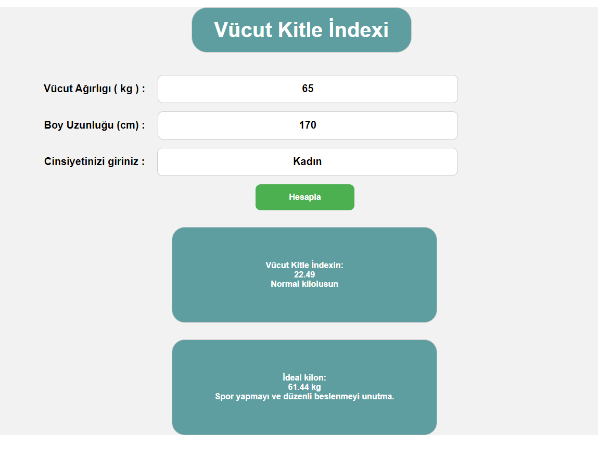

# Vücut Kitle İndexi

 

 Vücut Kitle İndeksi, bir diğer adıyla boy kilo indeksi vücudunuzdaki tahmini yağ oranını gösteren bir değerdir. İnsanın kilosunun boyuna göre normal olup olmadığının anlaşılması için kullanılır. Elde edilen değerle insanın kendisi için sağlıklı ve ideal kiloya ne kadar yakın olduğunu gösterir.

 

